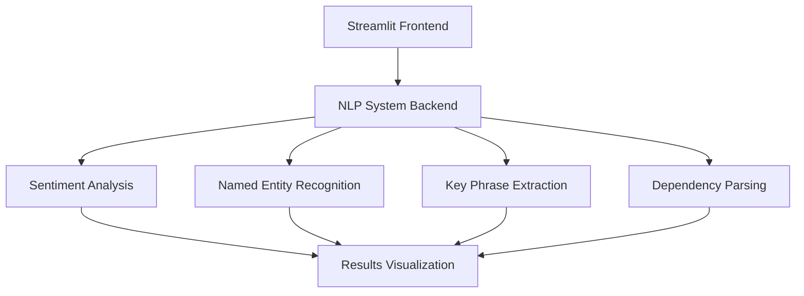

# Advanced NLP System 🤖

[](https://www.python.org/downloads/)
[](https://opensource.org/licenses/MIT)
[](https://streamlit.io)
[](https://pytorch.org)
[](https://huggingface.co/transformers)

A comprehensive Natural Language Processing system that integrates sentiment analysis, named entity recognition (NER), key phrase extraction, and dependency parsing using transformer-based models. The system is presented through a user-friendly Streamlit web interface.

## 📱 Application Preview


## 📊 Sample Analysis Results

| Text | Sentiment | Confidence Score |
|------|-----------|------------------|
| "I absolutely love this product! It's amazing and works perfectly." | Positive | 0.98 |
| "The service was okay, but could be better. Not terrible though." | Neutral | 0.65 |
| "This is the worst experience I've ever had. Never buying again." | Negative | 0.92 |

## 🌟 Features

- **Sentiment Analysis**: Real-time sentiment classification with confidence scores
- **Named Entity Recognition**: Advanced entity detection and classification
- **Key Phrase Extraction**: Automatic identification of important phrases
- **Dependency Parsing**: Syntactic analysis of text structure
- **Batch Processing**: Support for analyzing multiple texts simultaneously
- **Interactive Visualization**: Real-time results with intuitive displays
- **Export Capabilities**: Download analysis results in JSON format

## 📊 System Architecture



## 🚀 Quick Start

### Prerequisites

- Python 3.8 or higher
- CUDA-capable GPU (optional, for faster processing)
- Git

### Installation

1. Clone the repository:
```bash
git clone https://github.com/yourusername/advanced-nlp-system.git
cd advanced-nlp-system
```

2. Create and activate a virtual environment:
```bash
python -m venv venv
source venv/bin/activate  # On Windows: venv\Scripts\activate
```

3. Install dependencies:
```bash
pip install -r requirements.txt
```

4. Download required models:
```bash
python -m spacy download en_core_web_sm
```

### Usage

1. Start the web interface:
```bash
streamlit run streamlit_app.py
```

2. Open your browser and navigate to `http://localhost:8501`

## 🛠️ Configuration

### Environment Variables

| Variable | Description | Default |
|----------|-------------|---------|
| `CUDA_VISIBLE_DEVICES` | GPU configuration | All available GPUs |
| `TRANSFORMERS_CACHE` | Model cache directory | `~/.cache/huggingface` |
| `TORCH_HOME` | PyTorch cache directory | `~/.cache/torch` |
| `SPACY_MODEL_PATH` | spaCy model directory | `~/.cache/spacy` |

### Model Configuration

The system uses the following pre-trained models:

- **Sentiment Analysis**: `distilbert-base-uncased-finetuned-sst-2-english`
- **NER**: `dbmdz/bert-large-cased-finetuned-conll03-english`
- **Dependency Parsing**: `en_core_web_sm`

## 📚 Documentation

Detailed documentation is available in the following sections:

- [System Architecture](docs/architecture.md)
- [API Reference](docs/api.md)
- [User Guide](docs/user_guide.md)
- [Development Guide](docs/development.md)

## 🤝 Contributing

We welcome contributions! Please see our [Contributing Guidelines](CONTRIBUTING.md) for details.

1. Fork the repository
2. Create your feature branch (`git checkout -b feature/AmazingFeature`)
3. Commit your changes (`git commit -m 'Add some AmazingFeature'`)
4. Push to the branch (`git push origin feature/AmazingFeature`)
5. Open a Pull Request

## 📝 License

This project is licensed under the MIT License - see the [LICENSE](LICENSE) file for details.

## 🙏 Acknowledgments

- [Hugging Face](https://huggingface.co/) for the transformer models
- [spaCy](https://spacy.io/) for the NLP pipeline
- [Streamlit](https://streamlit.io/) for the web interface framework

## 📞 Contact

Emmanuel.O - Mannie297

Project Link: [https://github.com/yourusername/advanced-nlp-system](https://github.com/yourusername/advanced-nlp-system) 